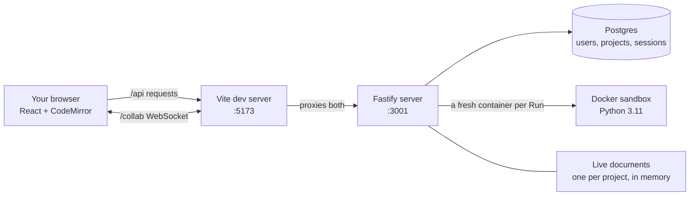

# Cloud IDE

A code editor that runs in your browser. You write Python, press Run, and it
executes safely inside a sandbox. Open the same project in two tabs and your
edits appear in both, live.

It's also a learning project with an unusual rule: **every piece gets built
the obvious way first, broken on purpose, measured, and only then fixed.** The
record of what broke and why lives in [`docs/`](docs/README.md), and it's the
most useful part of the repo. The full plan is in [CLAUDE.md](CLAUDE.md).

## What it looks like

Three screens: sign in, your projects, and the editor. The editor is laid out
like VS Code:

```
┌──────────────────────────────────────────────────────────────────┐
│ Cloud IDE › my-project › main.py                 Ctrl+Enter [Run] │  title bar
├────┬──────────────┬──────────────────────────────────────────────┤
│    │ EXPLORER     │ main.py                                        │  tab
│ [] │ MY-PROJECT   │  1  name = "world"                             │
│    │   main.py    │  2  print(f"hello {name}")                     │  editor
│ ## │              ├──────────────────────────────────────────────┤
│    │              │ OUTPUT                                         │
│    │              │ $ python main.py                               │  output
│    │              │ hello world                                    │
│    │              │ [Process exited with code 0]                   │
├────┴──────────────┴──────────────────────────────────────────────┤
│ * Live   my-project                   Ln 2, Col 7   Python   you@ │  status bar
└──────────────────────────────────────────────────────────────────┘
```

The status bar tells the truth about the connection: **Live**,
**Reconnecting…**, or **Offline** (it turns red). If you go offline you can
keep typing, and your edits sync when the connection comes back.

## How it works



In plain words, four things happen:

1. **Signing in.** Your password is never stored, only a scrambled version
   of it (a scrypt hash). When you sign in, the server gives your browser a
   session cookie that JavaScript can't read, which proves who you are on
   every request after that.
2. **Projects.** Each project belongs to one account. The server only ever
   looks up a project together with its owner, so asking for someone else's
   project gets "not found", even if you guess its id.
3. **Editing together.** The text isn't sent as "insert this at position 21"
   (that approach loses edits, see journal 0003). It's stored in a **CRDT**
   called Yjs, a data structure where edits merge the same way on every copy,
   in any order. Every tab of the project ends up with identical text.
4. **Running code.** Pressing Run sends the text to the server, which starts a
   locked-down Docker container, runs `python main.py` inside it, sends back
   the output, and throws the container away.

## Run it on your machine

You need **Node 20+** and **Docker Desktop** (running).

```bash
# 1. Settings. The values in the example are fine for local use.
cp .env.example .env              # PowerShell: copy .env.example .env

# 2. Start the database
docker compose up -d

# 3. Install the server and create the database tables
cd server
npm install
npx drizzle-kit migrate
cd ..

# 4. Build the sandbox image the server runs code in
docker build -t cloud-ide-runner-python:latest server/runner
```

Then start both halves, each in its own terminal:

```bash
# terminal 1: the server, on http://127.0.0.1:3001
cd server
npm run dev

# terminal 2: the website, on http://localhost:5173
cd web
npm install
npm run dev
```

Open **http://localhost:5173** and create an account. Use a throwaway
password: this is a learning build that has never been security reviewed.

> We also keep a conda env (`conda activate cloud-ide-runner`) active in every
> terminal as a shared habit. Nothing depends on it; Docker runs the code.

## Using it

- Create a project, open it, write some Python, and press **Run** or
  **Ctrl+Enter**.
- Open the same project in a second tab to see edits sync live.
- Only you can open your projects. Sharing with another person isn't built
  yet.

If your program stops unexpectedly, it probably hit one of these limits:

| Limit | Value | What you'll see |
|---|---|---|
| Time | 5 seconds | `Killed: exceeded the 5s time limit` |
| Memory | 128 MB | `Killed: exit 137, likely exceeded the 128MB memory limit` |
| CPU | half a core | Code just runs slower |
| Processes | 64 | Starting more fails with `BlockingIOError` |
| Output | 1 MB per stream | `[output truncated at 1048576 bytes]` |
| Network | none | Any network call fails |
| Disk | read-only, except `/tmp` | Writing files fails |

## Where things live

```
server/                  The backend (Node + Fastify)
  src/index.ts           Starts the server; the Run endpoint
  src/auth/              Accounts, password hashing, sessions
  src/projects/          Project endpoints, always scoped to the owner
  src/collab.ts          Live editing over WebSocket, checks you own the project
  src/runner.ts          Runs code in a locked-down Docker container
  src/db/                Database tables (Drizzle)
  runner/Dockerfile      The sandbox image
  drizzle/               Database migrations, as plain SQL
web/                     The frontend (React + Vite)
  src/App.tsx            Picks which screen to show
  src/AuthForm.tsx       Sign in / create account
  src/ProjectsPage.tsx   Your projects
  src/Editor.tsx         The IDE workspace
  src/api.ts             Every call to the server goes through here
docs/journal/            What broke in each phase, with numbers
docs/adr/                Big decisions and why they were made
docker-compose.yml       Postgres, for local development only
```

## The journey so far

Each phase built the obvious thing, broke it, and fixed what broke:

| Phase | Built | What broke | The lesson |
|---|---|---|---|
| 1 | Editor and a server that runs code | Code typed in the browser read a file outside the project | Code has to run in isolation ([0001](docs/journal/0001-unsandboxed-execution.md)) |
| 2 | Running code in Docker | An infinite loop left its container running forever | Every run needs a deadline and a kill you verify ([0002](docs/journal/0002-container-leak-and-timeout.md)) |
| 3 | Live editing between tabs | 3 of 6 keystrokes vanished, and the copies never matched again | Merge edits with a CRDT, don't broadcast positions ([0003](docs/journal/0003-broadcast-cannot-converge.md)) |
| 4 | Accounts and projects | Any signed-in user could open anyone's project | Being signed in is not the same as being allowed ([0004](docs/journal/0004-authn-is-not-authz.md)) |

**Current phase: 4.** Next up is Phase 5, running things on Kubernetes locally.

## Working on this repo

- `main` always works at the current phase.
- Build on a branch (`git checkout -b your-name/feature`), open a pull
  request, and merge one at a time.
- Commit messages start with a type: `feat:`, `fix:`, `docs:`, `chore:`.
- Don't build ahead of the current phase. Arriving at each fix by watching
  the naive version fail is the whole point.

## Known limitations

These are deliberate for now, not oversights:

- **Localhost only.** Containers share the host's kernel, so one kernel bug
  would let code escape. Proper hardening is Phase 9, and nothing gets a
  public URL before then.
- **Code isn't saved to disk.** The text lives in server memory and in any
  open tabs. Restarting the server with a tab open restores it from that tab;
  restarting with every tab closed loses it. Saving is Phase 8.
- **One file per project**, and **no sharing** between accounts yet.
- **No rate limiting** on sign in or Run.
