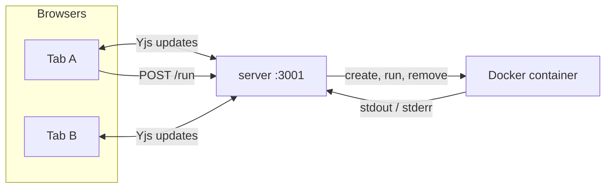

# Collaborative Cloud IDE

Browser-based IDE, built phase by phase. See [CLAUDE.md](./CLAUDE.md) for the
full project plan, current phase, and the rules for how we build here — read
it before touching anything.

## How it works

Current state of the system. Update this section when a phase changes the
shape of things — unlike `docs/journal/`, which is a frozen record of what
broke and when.

Two processes: `web` (React + Vite, port 5173) and `server` (Fastify, port
3001). Everything runs on localhost.

**Editing.** The document text lives in a [Yjs](https://yjs.dev) CRDT, not in
React state. `y-codemirror.next` binds that Yjs text to the CodeMirror editor
in both directions, and `y-websocket` carries updates to the server, which
holds the room's authoritative copy in memory and rebroadcasts merged updates
to everyone. Anyone who opens the app joins the same single room. If your
connection drops you keep typing against your local copy, and on reconnect
both sides merge with nothing lost. Why a CRDT rather than broadcasting edits:
`docs/adr/0001`.

**Running.** The Run button reads the current text out of the Yjs document and
posts it to `POST /run`. The server writes it to a file, starts a locked-down
Docker container with that file mounted read-only, streams back stdout and
stderr, then removes the container and deletes the file.



Guardrails in place: the WebSocket rejects upgrades from other origins (they
bypass CORS), the room name is fixed so the server can't be made to allocate
unlimited documents, socket errors can't crash the process, and the starting
content is seeded once server-side rather than by whichever client arrives
first.

Not built yet: no accounts and no separate projects, so **everyone shares one
document** (Phase 4). **Nothing persists** — restart the server and the
document is gone (Phase 8). No authorization on the socket at all, and no
terminal.

## Setup

Requires: Node 20+, npm, and Docker Desktop (running). Submitted code executes
inside a container, so nothing runs without the Docker engine up.

We also use a [conda](https://docs.conda.io/) env as the shell convention for
this repo. It doesn't run user code (Docker does, since Phase 2), but keep it
active so everyone's terminal behaves the same:

```bash
conda create -n cloud-ide-runner python=3.11   # one-time
conda activate cloud-ide-runner
```

Build the sandbox image once, and again whenever `server/runner/Dockerfile`
changes — the backend can't run anything without it:

```bash
docker build -t cloud-ide-runner-python:latest server/runner
```

Then, in two terminals:

```bash
# terminal 1 — backend, http://127.0.0.1:3001
cd server
npm install
npm run dev

# terminal 2 — frontend, http://localhost:5173
cd web
npm install
npm run dev
```

Open `http://localhost:5173`, write some Python, hit Run.

## Collaborating

Every browser that opens the app joins the same shared document, live. To try
it, open the app in **two different browser profiles** (not two windows of the
same profile — they share too much state to be a useful test). Type in one and
it appears in the other.

There are no accounts and no separate projects yet, so everyone shares one
room. Users and per-user projects are Phase 4.

## Execution limits

If your code dies unexpectedly, it probably hit one of these: 5s wall clock,
128MB memory, 0.5 CPU, 64 processes, 1MB of output per stream, no network
access, read-only filesystem except `/tmp`.

A script killed for exceeding memory exits with code 137 and prints nothing,
so the UI labels that case explicitly.

## Branching

- `main` stays deployable at the current phase.
- Build features on a branch (`git checkout -b your-name/feature`), open a PR,
  merge one at a time.
- Don't build ahead of the phase marked current in `CLAUDE.md`.

## Known limitation (by design, for now)

Code runs in a container with resource limits, no network, and a non-root
user, but a stock container still shares the host kernel — one kernel CVE and
user code is out. Real hardening (gVisor, seccomp, NetworkPolicy) is Phase 9,
and nothing gets a public URL before then. **Localhost only.**

The walls hit so far, and what they taught, are in `docs/journal/`.
