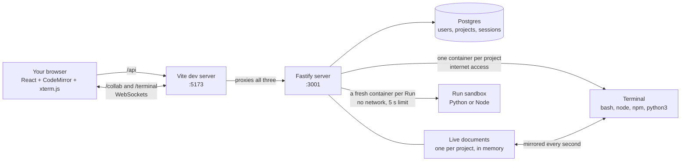

# Cloud IDE

A code editor that runs in your browser. Write Python or JavaScript and press
Run to execute it in a sandbox, or open the terminal and work in the project
the way you would on your own machine — `npm install`, `node`, `python3`. Open
the same project in two tabs and your edits appear in both, live.

It's also a learning project with an unusual rule: **every piece gets built
the obvious way first, broken on purpose, measured, and only then fixed.** The
record of what broke and why lives in [`docs/`](docs/README.md), and it's the
most useful part of the repo. The full plan is in [CLAUDE.md](CLAUDE.md).

## What it looks like

Three screens: sign in, your projects, and the editor:

```
┌───────────────────────────────────────────────────────────────────────┐
│ ⌂  my-project                                          you@mail.com  Y │  title bar
├──────────────┬───────────────────────────────────┬────────────────────┤
│ EXPLORER     │ main.py   app.js                  │ [Run ▶] Ctrl+Enter │
│ MY-PROJECT   │ src › app.js                      │ ┌────────────────┐ │
│ ▾ src        │  1  console.log("hi")             │ │ $ node app.js  │ │  output
│     app.js   │                                   │ │ hi             │ │
│   main.py    │                                   │ └────────────────┘ │
├──────────────┴───────────────────────────────────┴────────────────────┤
│ node@3ff6:/workspace$ npm install react                                │  terminal
├───────────────────────────────────────────────────────────────────────┤
│ ● Live                                           Ln 1, Col 18   JS     │  status bar
└───────────────────────────────────────────────────────────────────────┘
```

The status bar tells the truth about the connection: **Live**,
**Reconnecting…**, or **Offline** (it turns red). If you go offline you can
keep typing, and your edits sync when the connection comes back.

## How it works



In plain words, five things happen:

1. **Signing in.** Your password is never stored, only a scrambled version of
   it (a scrypt hash). The server gives your browser a session cookie that
   JavaScript can't read, which proves who you are on every request.
2. **Projects.** Each project belongs to one account. The server only ever
   looks a project up together with its owner, so someone else's project is
   "not found" even if you guess its id. You can create, rename and delete
   yours.
3. **Editing together.** Text isn't sent as "insert this at position 21" (that
   loses edits, see journal 0003). It lives in a **CRDT** called Yjs, where
   edits merge the same way on every copy, in any order.
4. **Running code.** Run sends the whole project to the server, which starts a
   locked-down container, runs the open `.py` or `.js` file, returns the
   output, and throws the container away.
5. **The terminal.** Each project gets one long-lived container with a real
   shell, shared by every tab that opens it. Its `/workspace` folder *is* the
   project: files you create in the shell appear in the explorer, and edits in
   the editor are on disk for the next command.

## Run it on your machine

You need **Node 20+** and **Docker Desktop** (running).

```bash
# 1. Settings. The values in the example are fine for local use.
cp .env.example .env              # PowerShell: copy .env.example .env

# 2. Start the database
docker compose up -d

# 3. Install the server and create the database tables
cd server
npm install
npx drizzle-kit migrate
cd ..

# 4. Build the three sandbox images
docker build -t cloud-ide-runner-python:latest server/runner/python
docker build -t cloud-ide-runner-node:latest   server/runner/node
docker build -t cloud-ide-workspace:latest     server/runner/workspace
```

Then start both halves, each in its own terminal:

```bash
# terminal 1: the server, on http://127.0.0.1:3001
cd server
npm run dev

# terminal 2: the website, on http://localhost:5173
cd web
npm install
npm run dev
```

Open **http://localhost:5173** and create an account. Use a throwaway
password: this is a learning build that has never been security reviewed.

> We also keep a conda env (`conda activate cloud-ide-runner`) active in every
> terminal as a shared habit. Nothing depends on it; Docker runs the code.

## Using it

- Create a project, open it, and either write a file and press **Run**
  (**Ctrl+Enter**), or use the terminal at the bottom.
- Hover a project card to **rename** (pencil) or **delete** (trash) it.
- Open the same project in a second tab: the editor and the terminal are
  shared.
- `npm create vite@latest` asks questions even when you pass `--template`.
  If it looks stuck, it's waiting for you — press Enter.
- `npm run dev` starts inside the container, but your browser can't reach it
  yet. Routing to one specific container is Phase 7.

The two sandboxes have different limits:

| Limit | Run | Terminal |
|---|---|---|
| Time | 5 seconds, then killed | none |
| Memory | 128 MB (exit 137 if exceeded) | 512 MB |
| CPU | half a core | one core |
| Processes | 64 | 256 |
| Output | 1 MB per stream | last 64 KB replayed when a tab connects |
| Network | none | internet |
| Disk | read-only, except `/tmp` | `/workspace` and `$HOME`; the rest read-only |
| User | non-root | non-root (`node`) |

The terminal's folder is mirrored into the editor except `node_modules`,
`.git`, `__pycache__`, `.venv`, `.cache`, binary files, files over 1 MB, and
anything past 200 files.

## Where things live

```
server/                    The backend (Node + Fastify)
  src/index.ts             Starts the server, registers everything
  src/auth/                Accounts, password hashing, sessions
  src/projects/            Project endpoints, always scoped to the owner
  src/run/routes.ts        The Run endpoint
  src/runner.ts            The only module that starts containers
  src/projectFiles.ts      Checks file paths, writes a project to a folder
  src/collab.ts            Live editing over WebSocket
  src/terminal.ts          The terminal over WebSocket, one shell per project
  src/workspaceSync.ts     Mirrors the terminal's folder into the document
  src/ws-auth.ts           Who may open a socket, and revoking it on logout
  src/ws-router.ts         Sends each WebSocket upgrade to its endpoint
  src/db/                  Database tables (Drizzle)
  runner/python/           Run sandbox image for .py
  runner/node/             Run sandbox image for .js
  runner/workspace/        Terminal image: node, npm, python3
  drizzle/                 Database migrations, as plain SQL
web/                       The frontend (React + Vite)
  src/App.tsx              Picks which screen to show
  src/AuthForm.tsx         Sign in / create account
  src/ProjectsPage.tsx     Your projects
  src/Workspace.tsx        The IDE: explorer, editor, output, terminal
  src/FileExplorer.tsx     The file tree
  src/CodeEditor.tsx       CodeMirror, bound to the live document
  src/Terminal.tsx         xterm.js, bound to the project's shell
  src/files.ts             Files and folders inside the live document
  src/api.ts               Every HTTP call to the server goes through here
infra/k8s/                 Kubernetes manifests, written by hand (Phase 5)
  pod.yaml                 A bare pod: delete it and nothing brings it back
  deployment.yaml          The same pod in a Deployment: it comes back
  web-demo.yaml            Two pods behind a Service: one address, any pod
docs/journal/              What broke, with numbers
docs/adr/                  Big decisions and why they were made
docker-compose.yml         Postgres, for local development only
```

## The journey so far

Each phase built the obvious thing, broke it, and fixed what broke:

| Phase | Built | What broke | The lesson |
|---|---|---|---|
| 1 | Editor and a server that runs code | Code typed in the browser read a file outside the project | Code has to run in isolation ([0001](docs/journal/0001-unsandboxed-execution.md)) |
| 2 | Running code in Docker | An infinite loop left its container running forever | Every run needs a deadline and a kill you verify ([0002](docs/journal/0002-container-leak-and-timeout.md)) |
| 3 | Live editing between tabs | 3 of 6 keystrokes vanished, and the copies never matched again | Merge edits with a CRDT, don't broadcast positions ([0003](docs/journal/0003-broadcast-cannot-converge.md)) |
| 4 | Accounts and projects | Any signed-in user could open anyone's project | Being signed in is not the same as being allowed ([0004](docs/journal/0004-authn-is-not-authz.md)) |
| 4 | A real terminal | Server restarts orphaned 12 of 16 terminal containers | What outlives its process needs a reconciler ([0005](docs/journal/0005-session-container-outlives-its-server.md)) |
| 4 | The terminal, in a browser | Six bugs a scripted test couldn't see | A test proves only what it exercises ([0006](docs/journal/0006-terminal-passed-every-test-but-the-browser.md)) |
| 4 | Syncing the terminal's folder | The trusted server followed paths the sandbox could plant links in | Keep the trusted side out of what the untrusted side writes ([0007](docs/journal/0007-trusted-server-followed-links-the-sandbox-made.md)) |
| 5 | Pods and Deployments by hand, on kind | A deleted pod came back in 1.1 s, but its files didn't; an idle pod took 31.4 s to stop | Kubernetes restores the template, not the state; PID 1 must handle SIGTERM ([0008](docs/journal/0008-reconciliation-restores-pods-not-their-state.md)) |
| 5 | A Service in front of two pods | It sent 29 of 60 connections to one pod and 31 to the other, at random | Balancing is for identical copies; workspaces need routing ([0009](docs/journal/0009-a-service-sends-you-to-any-pod.md)) |

**Current phase: 5.** Kubernetes locally, by hand: pods, Deployments,
Services, and watching a reconciliation loop bring back what you delete.

Phase 4 kept sign-in inside `server/` instead of splitting it into its own
service. Nothing needs it separately yet; the Phase 7 gateway will, when it
has to check sessions before forwarding a socket to a workspace.

## Working on this repo

- `main` always works at the current phase.
- Build on a branch (`git checkout -b your-name/feature`), open a pull
  request, and merge one at a time.
- Commit messages start with a type: `feat:`, `fix:`, `docs:`, `chore:`.
- Don't build ahead of the current phase. Arriving at each fix by watching
  the naive version fail is the whole point.

## Known limitations

These are deliberate for now, not oversights:

- **Localhost only.** Containers share the host's kernel, and the terminal can
  reach your network. Hardening is Phase 9; nothing gets a public URL before
  then.
- **Terminal containers leak when the server restarts** (journal 0005). Clean
  up with `docker ps -aq --filter label=cloud-ide.owner=terminal | xargs docker rm -f`.
  A reconciliation loop is Phase 6.
- **Code isn't saved.** Text lives in server memory and in open tabs.
  Restarting the server with every tab closed loses it. Saving is Phase 8.
- **The folder mirror is naive**: it polls every second, and if the shell and
  the editor change the same file within that second, the last one wins.
- **No sharing** between accounts, and **no rate limiting** on sign-in, Run,
  or starting a terminal.
