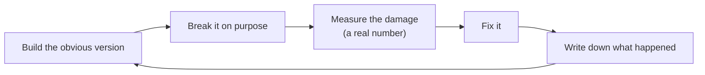

# The docs, explained

This folder is a record of how the project got built, including every wrong
turn. If you're new, start here.

## How every phase works

The project follows one loop, over and over:

The reason: a design you rebuilt because you *watched* the simple version
fail is one you actually understand. A design you copied is one you've only
memorized.

## Two kinds of notes

**The journal** (`journal/`) is a diary of walls hit. Each entry answers the
same five questions: what did I build, how did it break, what number proves
it, how did I fix it, and what would I check earlier next time. Most entries
also have a longer "deep dive" section underneath with diagrams and detail.
Entries aren't rewritten later, because the point is recording what was true
at the time.

**ADRs** (`adr/`, short for Architecture Decision Records) cover big
decisions that are expensive to undo, like which database to use. Each one
explains the situation, the choice, what was rejected and why, and what the
choice makes harder. If a later phase changes a decision, a *new* ADR
replaces it and the old one is marked "Superseded". That chain of changes is
part of the record too.

## Journal entries

| # | Title | In one sentence |
|---|---|---|
| [0001](journal/0001-unsandboxed-execution.md) | Unsandboxed execution | Code typed into the browser could read any file on the computer, because it ran with my own permissions. |
| [0002](journal/0002-container-leak-and-timeout.md) | A hung script leaks a container | An infinite loop kept its container alive forever, until every run got a deadline and a kill that's checked. |
| [0003](journal/0003-broadcast-cannot-converge.md) | Broadcasting edits can't converge | Sending edits as "insert at position N" lost half the keystrokes; a CRDT (Yjs) fixed it for good. |
| [0004](journal/0004-authn-is-not-authz.md) | Signed in isn't the same as allowed | Any signed-in user could open anyone's project; now every entry point checks who owns what. |

## Decisions (ADRs)

| # | Decision | In one sentence |
|---|---|---|
| [0001](adr/0001-crdt-for-collaborative-editing.md) | Yjs CRDT for live editing | Why edits merge through a CRDT instead of being broadcast as positions. |
| [0002](adr/0002-postgres-and-drizzle-for-users-and-projects.md) | Postgres + Drizzle | Why accounts, projects, and sessions live in Postgres, with migrations as plain SQL. |

## Words you'll run into

| Word | What it means here |
|---|---|
| **Sandbox** | A walled-off place to run code so it can't touch anything else. |
| **Container** | The sandbox we use: a Docker box with its own files, no network, and strict limits. |
| **CRDT** | A data structure where edits merge the same way on every copy, no matter what order they arrive in. |
| **Yjs** | The CRDT library this project uses for the editor text. |
| **WebSocket** | A connection that stays open, so the server can push edits to you instantly. |
| **Authentication (authn)** | Checking *who you are*. Your session cookie does this. |
| **Authorization (authz)** | Checking *whether you're allowed* to touch one specific thing, like a project. |
| **Session** | The server's record that you signed in. Deleting it signs you out. |
| **Migration** | A small SQL file that changes the database's structure, applied in order. |
| **Trust boundary** | The line between code we trust (the server) and code we don't (whatever you type). |
