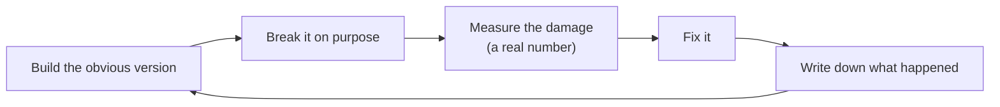

# The docs, explained

This folder is a record of how the project got built, including every wrong
turn. If you're new, start here.

## How every phase works

The project follows one loop, over and over:

The reason: a design you rebuilt because you *watched* the simple version
fail is one you actually understand. A design you copied is one you've only
memorized.

## Two kinds of notes

**The journal** (`journal/`) is a diary of walls hit. Each entry answers the
same five questions: what did I build, how did it break, what number proves
it, how did I fix it, and what would I check earlier next time. Most entries
also have a longer "deep dive" section underneath with diagrams and detail.
Entries aren't rewritten later, because the point is recording what was true
at the time.

**ADRs** (`adr/`, short for Architecture Decision Records) cover big
decisions that are expensive to undo, like which database to use. Each one
explains the situation, the choice, what was rejected and why, and what the
choice makes harder. If a later phase changes a decision, a *new* ADR
replaces it and the old one is marked "Superseded". That chain of changes is
part of the record too.

## Journal entries

| # | Title | In one sentence |
|---|---|---|
| [0001](journal/0001-unsandboxed-execution.md) | Unsandboxed execution | Code typed into the browser could read any file on the computer, because it ran with my own permissions. |
| [0002](journal/0002-container-leak-and-timeout.md) | A hung script leaks a container | An infinite loop kept its container alive forever, until every run got a deadline and a kill that's checked. |
| [0003](journal/0003-broadcast-cannot-converge.md) | Broadcasting edits can't converge | Sending edits as "insert at position N" lost half the keystrokes; a CRDT (Yjs) fixed it for good. |
| [0004](journal/0004-authn-is-not-authz.md) | Signed in isn't the same as allowed | Any signed-in user could open anyone's project; now every entry point checks who owns what. |
| [0005](journal/0005-session-container-outlives-its-server.md) | A session container outlives its server | Server restarts orphaned 12 of 16 terminal containers; the fix is a reconciliation loop, not better cleanup-on-exit. |
| [0006](journal/0006-terminal-passed-every-test-but-the-browser.md) | Passed every test but the browser | Six bugs hid behind a scripted test that wasn't the browser; the test has to take the user's path. |
| [0007](journal/0007-trusted-server-followed-links-the-sandbox-made.md) | The server followed the sandbox's links | The trusted server was writing into a folder the sandbox could plant symlinks in — a trust boundary crossed by accident. |
| [0008](journal/0008-reconciliation-restores-pods-not-their-state.md) | A pod comes back, its files don't | Kubernetes replaced a deleted pod in 1.1 s but not its files, and an idle pod took 31.4 s to stop until PID 1 handled SIGTERM. |
| [0009](journal/0009-a-service-sends-you-to-any-pod.md) | A Service sends you to any pod | A Service spread 60 connections 29/31 across two pods — fine for copies, but for workspaces half would reach someone else's project. |

## Decisions (ADRs)

| # | Decision | In one sentence |
|---|---|---|
| [0001](adr/0001-crdt-for-collaborative-editing.md) | Yjs CRDT for live editing | Why edits merge through a CRDT instead of being broadcast as positions. |
| [0002](adr/0002-postgres-and-drizzle-for-users-and-projects.md) | Postgres + Drizzle | Why accounts, projects, and sessions live in Postgres, with migrations as plain SQL. |
| [0003](adr/0003-terminal-container-per-project-with-mirrored-workspace.md) | The terminal's sandbox | One container per project, its folder mirrored into the live document, with internet access — and what that costs. |

## Left for later, on purpose

| What | Why not now | When |
|---|---|---|
| Sign-in as its own service | Only one server checks sessions today, so a split would be a guess about where the boundary is. | Phase 7, when the gateway has to check sessions itself. |
| Cleaning up leaked containers | Needs a loop that compares what should exist with what does (journal 0005). | Phase 6, the orchestrator. |
| Reaching one specific workspace | A Service picks any pod; a workspace needs *its* pod (journal 0009). | Phase 7, a lookup table and a gateway. |
| Keeping files when a pod dies | A replacement pod starts empty (journal 0008). | Phase 8, snapshots to S3. |
| Only one pod per project at a time | A Deployment starts the new pod before the old one stops (journal 0008). | Phase 8, "exactly one writer". |

## Words you'll run into

| Word | What it means here |
|---|---|
| **Sandbox** | A walled-off place to run code so it can't touch anything else. |
| **Container** | The sandbox we use: a Docker box with its own files and strict limits. Run's containers have no network; the terminal's can reach the internet. |
| **Egress** | Network traffic going *out* of a container. The terminal needs it for `npm install`. |
| **Reconciliation** | A loop that compares what *should* exist with what *does*, and fixes the difference. It survives crashes; cleanup-on-exit doesn't. |
| **Symlink** | A file that points at another path. Harmless inside a sandbox, dangerous if a trusted process follows it. |
| **CRDT** | A data structure where edits merge the same way on every copy, no matter what order they arrive in. |
| **Yjs** | The CRDT library this project uses for the editor text. |
| **WebSocket** | A connection that stays open, so the server can push edits to you instantly. |
| **Authentication (authn)** | Checking *who you are*. Your session cookie does this. |
| **Authorization (authz)** | Checking *whether you're allowed* to touch one specific thing, like a project. |
| **Session** | The server's record that you signed in. Deleting it signs you out. |
| **Migration** | A small SQL file that changes the database's structure, applied in order. |
| **Pod** | Kubernetes' smallest unit: one or more containers that start, run and die together. |
| **Deployment** | A Kubernetes request like "always keep 1 of this pod running". If the pod dies, a new one is made from the template. |
| **Service** | One fixed name and address for a group of pods, chosen by label. Sends each new connection to any one of them. |
| **Load balancing vs routing** | Balancing spreads work over identical copies. Routing sends you to one *specific* place. Workspaces need routing. |
| **PID 1** | The first process in a container. It must handle SIGTERM itself, or stopping the container waits out the whole grace period. |
| **Trust boundary** | The line between code we trust (the server) and code we don't (whatever you type). |
