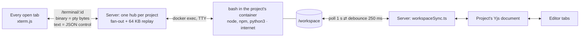

# 0003 — The terminal: one container per project, its folder mirrored into the document, with internet access

Status: Accepted · Date: 2026-09-13 · Phase: 4

## Context

The stack table always listed a terminal (`node-pty` + xterm.js, under Phase 3),
but it was never built. Project templates (an "Empty / Python / Node.js" picker)
stood in for it, and the user's verdict was that the picker wasn't needed — they
wanted to set up Python and Node projects themselves, from a real shell.

Nothing that existed could host one. Run's sandbox is a container *per request*:
a 5-second deadline, `--network none`, a read-only mount, and removal in
`finally`. A shell needs a process that survives across many commands.

Three measured forces shaped the decision:

- **The first version was a one-way snapshot**, per an explicit scope choice:
  files were copied into the container once, and nothing flowed back. Files
  created in the shell that reached the editor: **0**, by design — and the
  user's report was "I should be able to work in that project folder."
- **`npm create vite@latest` failed 1 of 1 times with `EAI_AGAIN`** (no DNS),
  because the terminal inherited Run's `--network none`. With egress on,
  `npm install react react-dom` added 3 packages in 7 seconds.
- **Keeping sessions in memory leaks**: 12 of 16 terminal containers orphaned
  after a day of restarts (journal 0005).

This changes an isolation boundary and adds a wire protocol, so it's a one-way
door.

## Decision

1. **One long-lived container per project**, not per tab, from a dedicated
   `cloud-ide-workspace` image (Node 24 with npm, plus python3). Non-root,
   read-only root filesystem, all capabilities dropped, `no-new-privileges`,
   512 MB / 1 CPU / 256 processes. Every §3 floor flag set, just with larger
   numbers than Run.
2. **The pty lives in the container**, through `docker exec` with a TTY — not
   `node-pty` on the host. One shell per project, with its output fanned out to
   every attached tab and input merged from all of them, like `tmux attach`.
3. **`/workspace` is the project.** A server-side mirror polls the folder every
   second and writes document changes to disk (250 ms debounce). File changes
   become minimal Y.Text edits (common prefix and suffix kept), not
   whole-document replacements. Tool output (`node_modules`, `.git`,
   `__pycache__`, `.venv`, `.cache`), binaries, files over 1 MB, and anything
   past 200 files are not mirrored.
4. **Egress for the terminal container only** (Docker bridge network). Run's
   one-shot sandbox keeps `--network none`.
5. **Wire protocol:** a WebSocket at `/terminal/:projectId`, authorized exactly
   like `/collab` — through a shared upgrade check, a single session-revocation
   loop, and one upgrade router, so the two endpoints can't disagree. Binary
   frames carry raw pty bytes both ways; text frames carry JSON control
   messages (`init` with the terminal size, and `resize`).

## Alternatives rejected

**`node-pty` on the host, as the stack table planned.** A shell running on the
host is Phase 1's wall with a nicer UI: the code runs as me. The pty has to be
on the inside of the boundary.

**A shell per tab.** Two tabs would get two shells with different working
directories and history. A pty has exactly one owner, the process, so sharing
one is natural. This is *not* Phase 3's broadcast trap: there are no replicas
to converge, just one authority fanned out to viewers.

**The one-way snapshot.** Built first and rejected by use (the 0 above).

**The Yjs document as the filesystem (a FUSE mount inside the container).**
Arguably the cleanest end state — a single copy, no mirror. It needs FUSE and
`CAP_SYS_ADMIN` in the container, which breaks the §3 floor.

**A file watcher instead of polling.** It's the obvious next step. Whether
host-side events fire reliably for writes made inside a Docker Desktop
container on Windows is unmeasured, and polling is the version that can be
slow but can't miss a change. It stays until its cost is measured.

**Keep `--network none` and add a registry proxy or egress allowlist.** Right
direction, but that's Phase 9's egress policy. Building it now would be
building a later phase's fix early.

**One image per language, as `containers.md` requires.** Rejected for the
terminal only: a shell is exactly where you move between runtimes. Run keeps a
separate image per language. This is a recorded exception to the rule, not a
change to it.

## Consequences

- **This is the first container with outbound network access.** On a bridge
  network it can reach the LAN and the host, not just the internet. That's
  acceptable only because nothing is publicly reachable (§3). Phase 9 owns a
  default-deny egress policy and blocking `169.254.169.254`.
- **This is the first execution without a deadline**, which breaks `backend.md`'s
  "owner and a hard deadline" rule. The leak in journal 0005 is the direct
  consequence, and a reconciliation loop (Phase 6) is the fix.
- **Terminal creation has no rate limit**, which `backend.md` requires for
  anything that starts execution — the same gap journal 0004 left open for Run.
- **A trusted process now reads and writes a folder untrusted code controls.**
  The symlink hole in journal 0007 is narrowed by `lstat` checks but not
  closed. The mirror belongs inside the sandbox — Phase 6's `workspace-agent`.
- **The mirror costs a full folder walk per open project, every second**, and a
  shell and an editor writing the same file within one interval resolve as
  last-writer-wins. Both are walls to measure, not to pre-empt.
- **ADR 0001 predicted this:** "any external process that writes to a project
  has to go through Yjs too." The mirror is that process.
- **`npm run dev` inside the container isn't reachable from the browser.**
  Routing a request to one specific container is Phase 7's gateway problem.
- **Files still live only in memory and in orphaned folders** until Phase 8.
