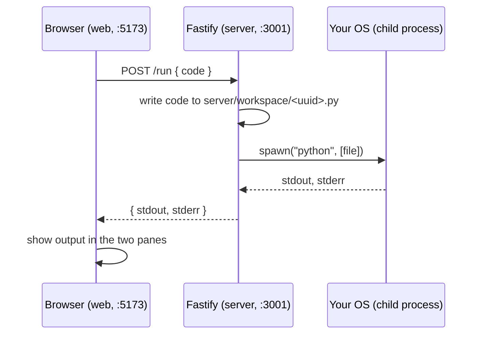

# 0001 — Unsandboxed execution reads anything on the host

**Built:** A Fastify server with one route, `POST /run`. It takes code from the
browser, writes it to a file in `server/workspace/`, and runs it with a plain
`child_process.spawn("python", [file])`. React + CodeMirror on the frontend,
a Run button, stdout/stderr shown back on the page.

**Broke:** Typed this into the editor and hit Run:

```python
with open(r"C:\Windows\win.ini") as f:
    print(f.read())
```

It printed the file. No error, no permission prompt, nothing. Same thing works
for anything else the local Windows account can read — SSH keys, other
projects, whatever.

**The number:** Zero. That's how many access checks stand between "text typed
in a browser tab" and "read any file my user account can read." Not
partial protection, not filtered, actually zero.

**Why, not just what:** the server doesn't sandbox the code, it just runs it.
`child_process.spawn` doesn't create a new user or a new filesystem view, it
just starts a process, and that process inherits every permission the Node
server itself has, which is every permission I have. There's no real fix for
this at the code level, you can't blocklist your way out of "the interpreter
can do anything a normal program can do." The actual fix is an OS-level
boundary around the whole process, a container, which is Phase 2.

**Would do differently:** nothing, honestly. This is the version you're
supposed to build first so the wall is real instead of theoretical. Trying to
patch this with path filters before moving to containers would've just taught
me that path filters don't work, which is a worse way to learn the same
lesson.

---

## Deep dive, for revision later

Everything below is extra detail for walking back through this later — the
five paragraphs above are the actual journal entry per repo convention, this
is just notes so future-me (or a friend reading this) doesn't have to
reconstruct the reasoning from scratch.

### What exists right now

Two processes on your machine, nothing else:

1. **`web`** — React + Vite page, CodeMirror editor, a Run button.
2. **`server`** — Fastify HTTP server with one route, `POST /run`.

No database, no auth, no containers, no network beyond `localhost`.

### How a "Run" click actually works



In plain words: you type Python into a box, the browser sends that text to
the server, the server saves it as a real `.py` file and asks the OS to run
it with `python`, then ships back whatever that program printed.

### The pieces, one by one

- **CodeMirror** (`web/src/App.tsx`) — a fancy `<textarea>` with syntax
  highlighting. It doesn't know or care what language it's editing; we just
  tell it "Python" so keywords get colored.
- **`fetch` to `/run`** — plain JSON over HTTP. No websockets yet (that's
  Phase 3, for live collaboration — this is single-user, single-request for
  now).
- **Fastify route handler** (`server/src/index.ts`) — the entire backend.
  Takes `code`, writes it to disk with a random filename so two requests
  never collide, runs it, waits for it to finish, sends back what it
  captured.
- **`child_process.spawn`** — Node's way of starting another program (here,
  `python`) and streaming its output as it runs. This is the load-bearing
  piece of Phase 1, and also its biggest problem.

### Why the boundary is missing, not just "insecure"

The server doesn't distinguish between "code I trust" and "code a stranger
typed into a browser." `child_process.spawn("python", [file])` runs with
exactly the same permissions as whoever started the server — right now, me.
If a friend's browser sent code that reads an SSH key, deletes a file, or
opens a socket, the server has no way to say no. It's not that this is
insecure, it's that there's no security concept here at all yet — no user,
no permission, no boundary. The fix isn't a smarter `if` in the route
handler, it's a real wall (a container) between "the server" and "the code
it runs." That's Phase 2.

### Decisions worth remembering

- **Why a random UUID filename per run, not one fixed `main.py`?** Two
  browser tabs running code at the same time would otherwise overwrite each
  other's file mid-execution. This doesn't fix concurrent *editing* (that's
  the Phase 3 CRDT problem) — it just stops one `/run` call from corrupting
  another's script file.
- **Why `spawn` and not `exec`?** `exec` buffers all output in memory and
  hands it back as one blob at the end (with a default 200KB limit);
  `spawn` streams it as it's produced. Doesn't matter for a one-line
  `print`, but it's the right primitive once scripts run longer or produce
  more output.
- **Why bind to `127.0.0.1` and not `0.0.0.0`?** `0.0.0.0` would make the
  server reachable from other devices on the network (or the whole internet,
  if port-forwarded). Given the missing trust boundary above, that turns "I
  can read my own files" into "anyone on my wifi can read my files." Not
  happening before Phase 9.

### What's deliberately not here yet

Not an oversight — building these now would mean solving problems we haven't
hit yet, which defeats the point of this project (see `CLAUDE.md`):

- Sandboxing / containers → Phase 2
- Real-time collaboration (WebSockets/CRDT) → Phase 3
- Login, users, ownership → Phase 4
- Anything resembling a public URL → not before Phase 9
