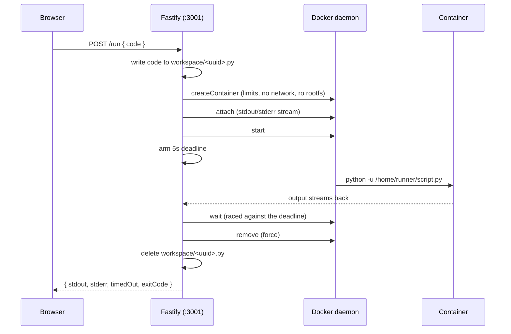

# 0002 — A hung script leaks a container forever
Date: 2026-09-09 · Phase: 2

**Built:** Moved code execution off bare `child_process.spawn` and into Docker.
Every `/run` request creates a fresh container from a digest-pinned
`python:3.11-slim` image, running as a non-root user, with `--memory`,
`--cpus`, `--pids-limit`, a read-only root filesystem, all capabilities
dropped, and no network. The submitted script gets bind-mounted in
read-only. One container per run, removed after it finishes.

**Broke:** Typed `while True: pass` into the editor and hit Run. The request
just sat there. In a second terminal, `docker ps` showed the container still
alive and spinning. Killed it by hand, clicked Run again with the same code,
got a second stuck container. Nothing about the setup would ever stop this on
its own, the container just runs until someone notices and kills it manually.

**Measured:** Two hangs, two leaked containers, zero self-cleanup. A 100%
leak rate on anything that doesn't finish by itself. Separately, timed a
normal container run at about 1.1 seconds of pure startup overhead before the
script even executes, worth remembering since that's now the cost every
single run pays, on top of whatever the code itself takes.

**Fixed:** Stopped using dockerode's `docker.run()` shortcut, since it only
hands back the container reference after everything's already done, too late
to kill anything mid-run. Switched to creating the container directly,
starting it, and arming a 5-second timer right after start, before awaiting
completion. If the script finishes first, the timer gets cancelled. If the
timer fires first, it calls `container.stop({ t: 2 })`, which is Docker's own
version of "ask nicely with SIGTERM, then force it with SIGKILL if that's
ignored." Re-ran the same infinite loop, it got killed at 5 seconds instead
of hanging forever, and `docker ps -a` came back clean afterward.

**Would do differently:** Two things worth naming, not fixing. First, the
plan's other break test, two tabs both writing `main.py`, never actually
happened here, because Phase 1 already gave every run a random filename to
avoid two requests colliding on one script file. Lucky, not planned, but
worth knowing why. Second, the plan's suggested fix is "container per session
plus TTL," and what got built instead is container-per-run, a fresh one every
click. That's a real, simpler version of the same idea (bounded, cleaned up,
nothing orphaned), it just means every run repays that 1.1 second startup
cost instead of reusing a warm container across a session. That reuse only
starts paying for itself once sessions and collaboration actually matter, so
it's staying out for now instead of getting built early.

---

## Deep dive, for revision later

The five paragraphs above are the journal entry proper. Everything here is
detail I'd want if I came back to this cold.

### How a run worked (Phase 2 snapshot)



The important shift from Phase 1: Fastify no longer runs anything itself. It
asks the Docker daemon to run something, and the daemon owns the process. The
server's job became lifecycle management, and that turned out to be where all
the bugs were.

### What each flag is actually buying

- `Memory: 128MB` — the kernel SIGKILLs the process if it goes over. This is
  what makes a runaway allocation a shrug instead of a swap-thrashing laptop.
- `NanoCpus: 0.5` — half a core. An infinite loop spins, but only on its own
  half core.
- `PidsLimit: 64` — a fork bomb hits a wall at 64 processes.
- `ReadonlyRootfs` + `Tmpfs /tmp` — nothing the code writes survives, and the
  image itself can't be modified. `/tmp` is memory-backed and vanishes.
- `CapDrop: ALL` — no raw sockets, no ptrace, no mount, none of it.
- `SecurityOpt: no-new-privileges` — blocks setuid-style escalation inside.
- `NetworkMode: none` — no network interface at all. Can't phone home, can't
  reach the cloud metadata endpoint (which is how an escaped container steals
  IAM credentials, per Phase 9).
- `USER runner` (uid 10001) in the Dockerfile — non-root, so an escape starts
  from a much worse position.
- Base image pinned by digest, not tag — a tag is a moving pointer the
  maintainers can repoint at any time, like a git branch. A digest is a
  content hash, like a commit sha. For something running untrusted code, you
  want to know exactly what's inside.

### How the 1.1 seconds was measured

```powershell
Measure-Command { docker run --rm <all the flags> ... python /home/runner/script.py }
```

That's total wall time for a script that only prints one line, so effectively
it's all container startup. Phase 1's bare `spawn` was single-digit
milliseconds. Roughly a 100x increase in per-run latency, bought deliberately
in exchange for the isolation. Worth remembering when Phase 6 starts caring
about cold start times.

### Why `docker.run()` had to go

Dockerode's `docker.run()` convenience method only hands back the container
object once everything has finished. That's useless for killing a hung
script, because you need the handle *while* it's still running. Switching to
`createContainer` → `attach` → `start` → `wait` gives you the reference up
front, so a timer can act on it. Small API detail, but it's the difference
between being able to enforce a timeout and not.

### Three review rounds, and what that taught

This is the part worth remembering. The fix for the leak was itself buggy,
and so was the fix for the fix.

**Round 1** found seven problems. The container leaked on any error path
because there was no `try/finally`. The timeout's kill wasn't verified, so if
`stop()` failed the code sat waiting forever, which is exactly the failure the
timeout existed to prevent. Output buffers were unbounded, so a chatty script
could OOM the Node server even though the container itself was capped. Killed
scripts returned empty output because Python block-buffers stdout when it
isn't attached to a terminal, fixed with `python -u`. Workspace files were
never deleted. Internal errors leaked host paths to the browser. Containers
had no labels, so nothing could identify them later.

**Round 2** confirmed those fixes were correct and then found more. Fastify
with no `logger` option makes `app.log` a no-op, so the error handler added in
round 1 was hiding errors from the user *and* discarding them entirely.
Nobody would ever have known. The frontend had no `res.ok` check, so an HTTP
500 rendered identically to a successful run that printed nothing. Only
`wait()` had a timeout, so a wedged daemon could still hang a request forever.

**Round 3** cleared it to merge but caught two more. The `withTimeout` wrapper
added in round 2 introduced a *new* leak: if `createContainer` times out, the
underlying call is still in flight, and if it lands afterwards nobody holds
the handle, so the container is orphaned. Giving up on a promise doesn't
cancel the work behind it. And the exit code from `wait()` was being thrown
away, which hid the failure below.

The generalisable lesson: every round of fixes was written carefully and every
round introduced or missed something. Error paths are where bugs live because
they're the paths nobody exercises. "I fixed it" is a hypothesis, not a
result.

### The invisible failure worth knowing about

A script that exceeds the memory limit gets SIGKILLed by the kernel. Python
never runs an exception handler, so it prints nothing at all:

```
input:  x = bytearray(500 * 1024 * 1024)
result: stdout "", stderr "", exitCode 137
```

Before the exit code was surfaced, that rendered in the UI as two empty boxes,
which is exactly what a successful `print`-nothing script looks like. The
resource limit added in this phase created a brand new way to fail silently.
137 is 128 + 9, the shell convention for "killed by signal 9". Worth
recognising on sight.

Verified behaviour after the fix:

| input | exitCode | stderr |
|---|---|---|
| `print("ok")` | 0 | empty |
| `raise ValueError("boom")` | 1 | traceback |
| 500MB allocation | 137 | empty, UI adds a note |
| `while True: pass` | killed at 5s | UI adds a note |
| `print("x" * 10_000_000)` | 0 | stdout capped at exactly 1048576 bytes + marker |

### Still open

Who cleans up if the *server* crashes mid-run? Nothing does. The container
keeps running with nobody watching it. The `cloud-ide.owner` label exists so a
future sweeper can find them, but no sweeper exists. Phase 6 answers this
properly with a reconciliation loop, which is the general pattern: a process
that periodically compares what should exist against what does exist beats
one that tries to clean up on its way out, because the second kind doesn't run
when it dies unexpectedly.
