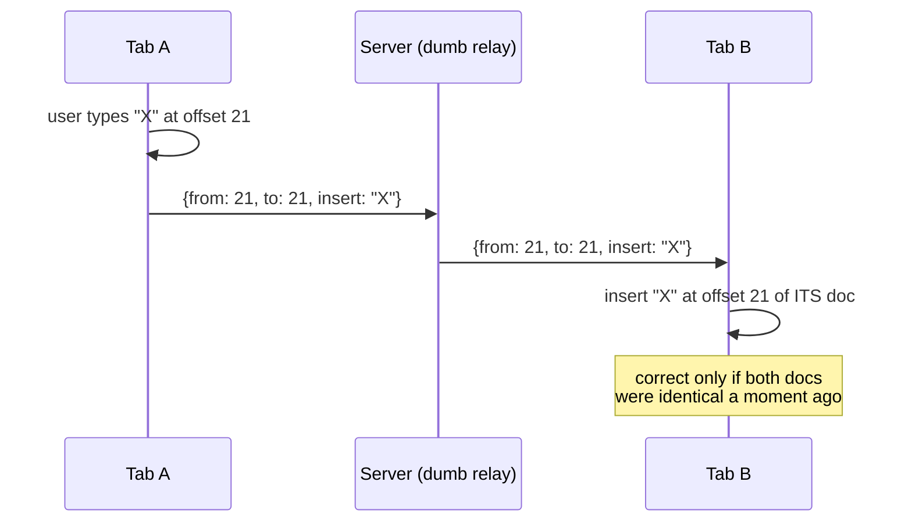

# 0003 — Broadcasting edits cannot converge
Date: 2026-09-10 · Phase: 3

**Built:** Real-time collab the obvious way. A `ws` server holding one room and
one set of sockets, forwarding every message it receives to everyone else,
verbatim, in arrival order. The client sends each CodeMirror change as
`{from, to, insert}` and applies whatever it receives straight to the editor.
About twenty lines on the server, thirty on the client. Typing in one tab
showed up in the other immediately, which is exactly why this approach is so
easy to believe in.

**Broke:** Two Chrome profiles side by side, both freshly loaded on the same
document. Set tab 2's DevTools network to Offline without reloading, so the
app kept running and only the connection died. Typed `AAA` on line 2 in tab 1
and `BBB` on line 2 in tab 2. Put tab 2 back online. Tab 1 ended up with
`BAAA`, tab 2 with `AABBB`.

**Measured:** Of the six keystrokes sent between the two tabs, three arrived.
Tab 1 received one of tab 2's three characters, tab 2 received two of tab 1's
three, so half the edits vanished with no error thrown anywhere. Line 2 now
matches in one position out of five. The documents are 25 and 26 bytes and
will never be byte identical again, because nothing in the system resyncs, or
even notices. The status indicator read `SOCKET: CONNECTED` through all of it.

**Fixed:** Deleted the broadcast code rather than patching it, and replaced it
with Yjs. The reason patching can't work is worth stating plainly: `{from: 21,
insert: "A"}` is a character offset, and an offset only means something
relative to one specific document state. Tab 2 applies it to a different
document, where offset 21 is somewhere else, and every later edit compounds
the error. Crucially there is no ordering that fixes this. Both users typed at
position 21 of their own document at the same instant and both were right, so
"whose edit goes first" has no correct answer and the information needed to
decide it was never in the message. That is the general shape of it:
**position-based operations cannot converge under concurrency.** A CRDT
replaces positions with identities, so "the character I inserted" stays
meaningful no matter what else happened.

**Would do differently:** Check whether the data model can even represent
concurrency before writing any transport code. All the effort here went into
plumbing, and the plumbing was never the problem. Also worth learning the hard
way: `ws.readyState === OPEN` does not mean messages are being delivered. A
socket reports open until TCP happens to notice otherwise, which can take
minutes, so liveness has to be decided at the application layer with a
heartbeat. Ours reported healthy while it was dropping half the traffic
through it, which is a worse failure than reporting an outright error.

---

## Deep dive, for revision later

Notes from actually running this, so future me doesn't have to work it out
again. The five paragraphs above are the journal entry proper.

### What the naive version actually did

The server holds no document and understands nothing. It keeps a `Set` of
sockets and forwards whatever bytes arrive to everyone else. All the meaning
lives in the message, and the message is an offset, which is the problem.

### The three test runs, and why the first two didn't count

1. Two windows, same Chrome profile. Set one to Offline in DevTools, but the
   tab reloaded while offline so it showed Chrome's dinosaur page. No app
   running means no document, so nothing to diverge. Useless run.
2. Two windows, same Chrome profile, page loaded first this time. Got real
   divergence, but a shared profile shares too much of the network stack, so
   throttling "one" window is not clean isolation. Result was suggestive but
   not trustworthy.
3. Two separate Chrome profiles. Clean. This is the run the numbers come
   from.

The lesson that generalises beyond this project: an experiment that doesn't
actually isolate the variable proves nothing, no matter how convincing the
output looks. It took three tries to get one honest measurement, and the two
bad runs looked fine at the time.

### How to reproduce it

Both tabs freshly loaded on the same document, so they genuinely start
identical. In tab 2, open DevTools, Network tab, set throttling to Offline,
and **do not reload** (reloading while offline kills the page, see run 1
above). Type `AAA` on line 2 in tab 1 and `BBB` on line 2 in tab 2, then set
tab 2 back to No throttling.

Result: tab 1 held `BAAA`, tab 2 held `AABBB`.

### Working out the numbers

Tab 1 typed three characters, tab 2 typed three, so six edits total were sent.
Tab 1's document ended up containing one `B`, meaning it received one of tab
2's three. Tab 2's contained two `A`s, so it received two of tab 1's three.
Three of six arrived, half the edits gone. Comparing line 2 position by
position, `BAAA` against `AABBB`, exactly one position out of five matches.
Whole documents came to 25 and 26 bytes, and different lengths alone means
they can never match again.

### The status indicator was lying

Both tabs displayed `SOCKET: CONNECTED` for the entire experiment, including
while edits were disappearing. Two reasons, and the second one matters more:

DevTools' Offline mode doesn't reliably close a WebSocket that's already
open, so `onclose` never fired and our reconnect logic never ran. That part
is a quirk of the tool.

The real issue is that `ws.readyState === OPEN` never meant "messages are
arriving" in the first place. It means the socket object hasn't been told
otherwise. In production a dead wifi connection or a silently dropped NAT
mapping can leave a socket looking open for minutes before TCP notices. The
only way to actually know is to decide it yourself: send a ping every few
seconds, expect a pong, and declare the connection dead after a few misses.
Liveness is an application-layer question. `y-websocket` does exactly this
internally, which is part of why swapping to it removed work rather than
adding it.

### The same experiment, after the swap

Ran the identical test against the Yjs version. Both tabs ended up with
`AAABBB` on line 2. (First attempt at this one was botched too, typed into
the wrong tab. That's four experiments in this phase and three bad runs
before a good one, which is roughly the real ratio and worth expecting rather
than being surprised by.)

| | naive broadcast | Yjs |
|---|---|---|
| edits delivered | 3 of 6 | 6 of 6 |
| positions differing on line 2 | 4 of 5 | 0 |
| documents identical afterwards | never | yes, on reconnect |
| status during the outage | said `connected` | flipped to `connecting` |

Two details worth noticing. The status indicator became honest for free,
because y-websocket runs its own ping/pong rather than trusting
`readyState`. And neither tab asked the server who won: both independently
computed `AAABBB` because a CRDT merge is deterministic and commutative, so
every replica lands on the same result regardless of what order things
arrived in. The interleaving isn't necessarily what either person expected,
but each person's characters stayed contiguous and nothing was dropped.

### What the swap deleted

Removed entirely from the client: the `applyingRemote` flag that stopped
edits echoing forever, the manual reconnect loop and its retry timer, the
`onChange` handler that serialised changes to the wire, the editor ref, the
`onmessage` dispatch, and the React `code` state that mirrored the document.
The server went from a socket set plus a forwarding loop to a single call to
`setupWSConnection`. Net result is less code doing strictly more, which is
the usual sign that the previous version was fighting its own data model.

### Why patching this was never on the table

The tempting fixes all fail for the same reason. Sequence numbers tell you
what order messages were sent in, but the problem isn't ordering, it's that
each offset was computed against a different document. An authoritative
server copy just moves the question to "which client's version wins," and
whichever loses silently discards someone's typing. Acknowledgements make you
wait on the network before showing your own keystrokes, which is a worse
editor.

The thing that actually fixes it is changing what a message says. Instead of
"insert at position 21," a CRDT says "insert after the character with id
`c1:47`." Identities don't move when other people edit around them, so the
same message stays correct no matter what order it arrives in or what else
happened first. That's the whole idea, and it's why the transport code was
never the interesting part.
