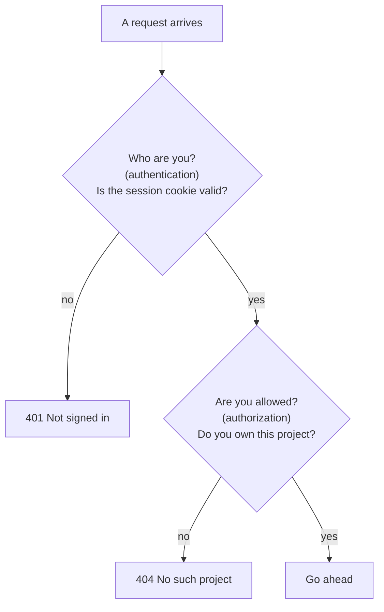

# 0004 — Being logged in is not the same as being allowed
Date: 2026-09-12 · Phase: 4

**Built:** Email and password accounts with scrypt hashing, server-side
sessions in an httpOnly cookie, and projects owned by users. Postgres in
Compose, Drizzle for the schema. Three project routes: create one, list mine,
open one by id. Every route reads the session cookie and rejects you if you
aren't signed in, which felt like the job was done.

**Broke:** Registered two accounts. Alice made a project, Bob made his own.
Bob's project list correctly showed only Bob's. Then Bob requested Alice's
project id directly and got HTTP 200 with the whole thing. The response even
included `ownerId`, Alice's user id, so the server knew perfectly well the
project wasn't his and handed it over anyway. Then opened a WebSocket to the
collab room with no cookie at all, no account, never registered. It connected.

**Measured:** Of the four entry points that touch a protected resource, one
does the check. `GET /projects` is correctly scoped to the owner.
`GET /projects/:id` authenticates and never authorizes. `POST /run` and the
WebSocket upgrade require nothing whatsoever, so two of the four don't even
ask who you are. One in four.

**Fixed:** Scope the query rather than checking after the fact. `GET
/projects/:id` now filters on id *and* `ownerId`, so an unauthorized project
comes back as "not found" rather than being fetched and then rejected — the
row never leaves the database. `POST /run` requires a session. The WebSocket
upgrade resolves the session cookie and the project's owner before the socket
exists, and rejects the handshake otherwise. The general rule that came out of
it: **authentication is a property of the request, authorization is a property
of the request and one specific resource.** A session proves who you are and
nothing more, so every entry point has to ask its own question, and a
WebSocket upgrade is an entry point even though it doesn't look like one.

**Would do differently:** Notice when a variable is loaded, validated, and
then never used again. In the broken route, `user` was fetched, checked for
existence, and then took no part in the query — that's the whole bug, visible
without knowing anything about auth. Also worth internalising: `POST /run` had
been unauthenticated since Phase 1 and nobody noticed, because it never looked
like an auth problem, it looked like a code runner. Entry points accumulate
quietly, and the ones that predate your auth system are the ones that never
get retrofitted.

---

## Deep dive, for revision later

The five paragraphs above are the journal entry proper. This part is detail
for coming back to it cold.

### The two questions every request has to answer

Before the fix, `GET /projects/:id` only asked the first question. `POST /run`
and the WebSocket asked neither.

### Every entry point, before and after

Checked against the live server after the fix:

| Entry point | Before | After |
|---|---|---|
| `GET /projects` | only your projects | unchanged |
| `GET /projects/:id`, someone else's | 200, their whole project | 404 |
| `POST /run`, not signed in | ran the code | 401 |
| WebSocket, no cookie at all | connected | 401 |
| WebSocket, signed in but not the owner | connected | 401 |
| WebSocket, signed in owner | connected | connected |
| WebSocket from another website | connected | 401 |

### Why "not found" instead of "forbidden"

Answering 403 would tell Bob "that project exists, you just can't have it",
which is information he shouldn't get. 404 says the same thing whether the
project is missing or merely not his. The fix does this naturally: the
database query asks for "this id *and* this owner", so a project you don't
own never leaves the database in the first place.

### Why the WebSocket needed a different fix

HTTP routes get a parsed cookie from Fastify. A WebSocket upgrade is a raw
HTTP request that happens before Fastify is involved, so it has to read the
`Cookie:` header by hand. The obvious hook for rejecting connections,
`verifyClient`, runs synchronously, and deciding needs a database lookup. So
the server now handles the upgrade itself (`noServer: true`), finishes the
session and ownership check, and only then hands the connection to Yjs.

### What review found after the fix

As in Phase 2, the fix itself had bugs, all in paths nobody tries on purpose:

- **Errors leaked internals on exactly the new routes.** Fastify locks in a
  route's error handler when the route is registered, and ours was set up
  after the auth routes. Two sign-ups racing on the same email leaked the
  database constraint name.
- **Login timing gave away who has an account.** An unknown email answered
  in about 1ms, a real one in about 100ms, because only real accounts paid
  for the password hash. Now both paths run the hash. One gap remains:
  accounts created before the hash format changed still verify at the old,
  cheaper cost, so they answer about 4x faster than an unknown email. That
  reveals only "this is an old account", on a handful of local test rows.
- **Logging out didn't reach open connections.** The session row was
  deleted, but a live editor stayed connected. Sockets are now re-checked
  every 30 seconds; in the test, one closed 18 seconds after logout.
- **The race fix didn't fix the race.** Drizzle wraps database errors, so the
  "email already taken" code lives at `err.cause.code`, not `err.code`. The
  first attempt returned 500 on every race. Found only by actually racing
  three requests.

### The logout bug I "proved" fixed twice

Signing out showed the login form, but refreshing signed you straight back
in. My first guess was browser caching, and I added no-cache headers. That
changed nothing.

The real cause: every request was labelled `Content-Type: application/json`,
including logout, which has no body. The server rejects an empty body
labelled as JSON, so logout failed, and the sign-out button swallowed the
error and showed the login form anyway. The session was never deleted.

My tests kept passing because I sent logout with curl, and curl didn't add
that header. I was testing a slightly different request than the browser
sends. Same lesson as Phase 3's bad test runs: an experiment that doesn't
reproduce the real conditions proves nothing, however convincing it looks.

### Gaps left on purpose

- Signing up with a taken email still says so (409), which reveals the email
  has an account. Hiding it needs email verification, which doesn't exist.
- A logged-out editor can stay connected for up to 30 seconds.
- No rate limiting on sign in or Run.
- The cookie isn't marked `Secure` and the allowed origin is hardcoded, both
  correct for localhost and wrong anywhere else.
