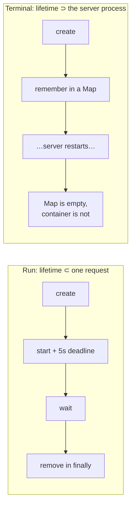

# 0005 — A session container outlives the server that made it
Date: 2026-09-13 · Phase: 4

**Built:** A terminal needs a shell that survives between commands, so Phase
2's container-per-run couldn't host one. Built the obvious long-lived version:
the first tab to open a project's terminal starts a container for it, and a
`Map<projectId, session>` in the server's memory remembers it so later tabs
attach to the same shell. Deliberately no TTL and no cleanup on disconnect.

**Broke:** Didn't have to try — ordinary development did it. `tsx watch`
restarts the server on every save, the map comes back empty, and the next tab
that reconnects gets a brand-new container while the old one keeps running with
nobody holding its handle. A crash would do exactly the same.

**Measured:** After one afternoon of work, `docker ps` showed **16 terminal
containers for 4 projects: 12 orphans, 75% of what was running.** One of the 4
projects had already been deleted, and its delete removed nothing, because the
route can only reach sessions the *current* process created. 28 workspace
folders sat on disk for the same reason. For contrast, the Run sandbox leaked
**0**: a container created, deadlined and removed inside one request has
nothing to forget.

**Fixed:** Two narrow things only. Two tabs opening one project at the same
moment used to race into two containers; creation is now shared through a
map of pending promises. Deleting a project removes its container and folder —
when this process made them. The orphans themselves are deliberately *not*
fixed: cleanup that runs "on the way out" is exactly the code a crash skips.
The answer is a loop that periodically lists containers by their
`cloud-ide.project` label, compares them against what should exist, and
removes the difference — **reconciliation**, Phase 6.

**Would do differently:** Notice that "remember it in memory" and "it lives
outside this process" can't both be the plan. Anything that can outlive the
process tracking it needs its record somewhere that outlives the process too.
The Docker daemon already *is* that place — the labels were on every container —
and I read from my own map instead. Journal 0002 ended with "who cleans up if
the server crashes? Nothing does." This entry is that sentence with a number.

---

## Deep dive

### Where the 16 came from

| Project | Containers | Still exists? |
|---|---|---|
| f63aff58… | 5 (4 workspace image, 1 older node image) | yes |
| 13e38c00… | 6 (4 workspace, 2 node) | yes |
| 863195a9… | 3 (2 workspace, 1 node) | yes |
| ed16c574… | 2 (workspace) | **no — deleted** |

The `cloud-ide-runner-node` ones predate the switch to the `cloud-ide-workspace`
image. Nothing ever removed them; the image change just stopped new ones.

### Why per-run never leaked and per-session did



The Run path's container lives strictly *inside* a request, so `finally` can
always reach it. The terminal's container lives *longer* than the process, so
no code in that process can be trusted to clean it up.

### The files question, arriving early

The orphaned folders still hold the files the shell wrote. A new session
starts a new empty folder and can't see them. CLAUDE.md predicted this for
Phase 6 — "adding TTL cleanup destroys user files" — and it showed up a phase
early: the moment a container can outlive its session, *where the files live*
becomes a real question. That's Phase 8.

### Cleanup, until the reconciler exists

```bash
docker ps -aq --filter label=cloud-ide.owner=terminal | xargs docker rm -f
```

Then delete `server/workspace/*` except `.gitkeep` while the server is stopped.
