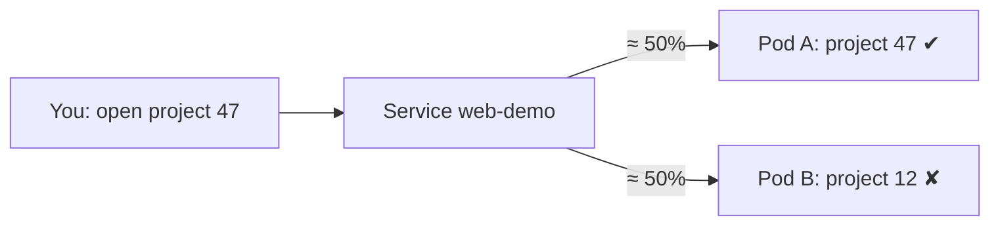

# 0009 — A Service sends you to any pod, which is wrong for workspaces
Date: 2026-09-13 · Phase: 5

**Built:** A tiny web server that answers with its own pod name, run as 2
copies by a Deployment, with a Service in front of them
([infra/k8s/web-demo.yaml](../../infra/k8s/web-demo.yaml)). The Service finds
its pods by label (`app: web-demo`), never by name, and gives them one fixed
address: `10.96.24.194`, reachable inside the cluster as `web-demo` through
CoreDNS.

**Broke:** Two experiments. First, deleted one of the pods while watching the
Service's list of pod IPs: it went from `.11,.12` to `.11` the moment the pod
started shutting down, then to `.11,.13` when the replacement was ready. The
address `web-demo` never changed — this part worked. Second, sent 20 requests
to `web-demo`, each on a new connection, and counted which pod answered. They
were spread across both pods at random. That's correct for identical copies,
and exactly wrong for workspaces: if the two pods were my project and a
friend's, the Service would send me to theirs about half the time.

**Measured:** Three runs of 20: **15/5, 5/15, 9/11 — 29 and 31 out of 60.**
So about **1 in 2 connections would reach the wrong workspace.** Deleting a pod
took about 1 s, because the server's PID 1 handles SIGTERM (the fix from
journal 0008, carried over).

**Fixed:** Nothing, on purpose. For identical, interchangeable pods, random
spreading *is* the right behavior. The problem only exists because workspaces
are **distinct and individually addressable** — "project 47" has to reach one
specific pod. No Service setting or sticky cookie can know that. The fix is a
lookup table (`project → pod address`) read by a gateway that forwards each
request — Phase 7.

**Would do differently:** Don't trust one short run. My first run of 20 said
15/5, which looks like the Service favors one pod; the next said 5/15. Only
the total, 29/31, shows it's random. Also, measure per *connection*: the test
opens a new one for every request (`agent: false`), because the Service picks
a pod when a connection opens. A client that reuses one connection would have
hit the same pod 20 times and made it look "sticky" when it isn't. The general
idea: **load balancing assumes the backends are interchangeable** — the moment
they hold different state, you need routing, not balancing.

---

## Deep dive

### What the Service keeps up to date

```text
$ kubectl get endpointslices -l kubernetes.io/service-name=web-demo -w
ENDPOINTS
10.244.0.11,10.244.0.12    both pods
10.244.0.11                kh79r deleted: removed as soon as it began stopping
10.244.0.11,10.244.0.13    the Deployment's replacement, added once ready
```

This is reconciliation again, one layer up: the Deployment keeps the *number*
of pods right (journal 0008), and the Service's controller keeps the *address
list* right. Neither ever lists a pod by name — both select by label — which is
why neither cares that pods are replaced.

### Name → address, inside the cluster

```text
$ kubectl exec deploy/web-demo -- getent hosts web-demo
10.96.24.194    web-demo.default.svc.cluster.local
```

`web-demo` is short for `<service>.<namespace>.svc.cluster.local`. CoreDNS (one
of the system pods in `kubectl get pods -A`) answers it with the Service's
fixed IP. The IP isn't a real machine; the node rewrites traffic to it into
one of the pod IPs, choosing when each connection opens.

### Why this matters for Phase 7



A Service answers "give me *a* copy". A workspace needs "give me *this*
project's pod". That's why CLAUDE.md says sticky sessions are the wrong model
for workspaces: stickiness keeps you on the same copy, but no hash of a cookie
can mean "project 47".

### The measurement script

```js
// 20 requests, each on a fresh connection, then count answers per pod
const http = require('http'); const t = {}; let n = 0;
(function go() {
  http.get({ host: 'web-demo', agent: false }, r => {
    let b = ''; r.on('data', d => b += d);
    r.on('end', () => { b = b.trim(); t[b] = (t[b] || 0) + 1;
      if (++n < 20) go(); else console.log(t); });
  });
})();
```
